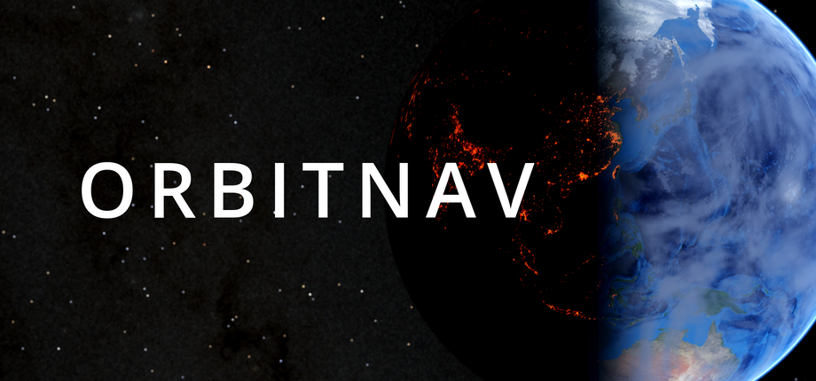

Off-thread voxel navigation for Godot 4, in Rust.

A uniform grid of cells, each free or solid, plus everything a mover needs to cross one: which free cells
touch solid, which cells can reach each other, whether a straight segment is clear, the nearest usable cell
to a point, and an A\* route between two points. A worker pool runs all of it off the main thread.

```gdscript
var vol: NavVolumeHandle = Nav.make_volume(origin, 1.0, dims)
vol.begin_geometry()                     # hand over collision shapes...
vol.add_shape(shape, body_xform * shape_xform)
var bake: NavPathJob = vol.voxelize()    # ...and a worker decides which cells are solid, then derives
# ... once bake.is_settled() ...
vol.apply_derive(bake)

var job: NavPathJob = vol.request_path(from_p, to_p, false, 6000)
# ... once job.is_settled() ...
var path: PackedVector3Array = job.take()
```

## What it does not do

**It does not decide anything.** No behaviour trees, no target selection, no steering. The addon is named
for navigation rather than for AI deliberately: an addon named for AI attracts decision code, which is the
half that should stay in the game.

**It does not look at your world.** Which bodies count as geometry is yours to decide. You either hand over
the collision shapes of the bodies you choose, or one byte per cell you filled yourself; everything after
that is this addon's.

**Voxelizing reproduces a box query.** A cell is solid when a box the size of the cell touches a shape, with
the two rules a Jolt Physics `intersect_shape` applies: the query box and convex shapes are rounded by their
collision margin, and a `ConcavePolygonShape3D` only reports cells in front of its faces unless
`backface_collision` is set. Measured against a per-cell Jolt query over 16 volumes (hulls, excavated rock,
box-slab scaffolds; 154 000 solid cells), it missed no solid cell. Every cell it added is an exact face contact,
which Jolt's `f32` rounding reports on some plates and not on others.

## Why it exists

Deriving a grid and searching it are pure array work over a few hundred thousand cells, and
in a scripting language that is seconds per bake and milliseconds per search — on the thread the game is
trying to render on. Both are also embarrassingly movable: no scene tree, no physics, no engine services.

Two consequences shape the whole design:

- **One crossing per operation.** A call across the extension boundary costs about 0.185 µs. That is
  nothing per operation and fatal per cell, so every function takes or returns a whole array and there is
  deliberately no per-element entry point.
- **A worker pool, not a coroutine.** Nothing here blocks the caller. Volumes are immutable snapshots
  behind a generation counter, so a job in flight cannot be torn by a republish — it finishes against what
  it started with, and its result reports as stale rather than being handed back.

## Outcomes, not empty arrays

A search that returns no waypoints has told you almost nothing. `NavPathJob.outcome()` separates the cases
that want different responses:

| outcome | what to do |
|---|---|
| `UNREACHABLE` | the two ends are in different components. Stop asking. |
| `CAPPED` | the expansion budget ran out with the frontier alive. Ask again with more. |
| `UNSNAPPABLE` | an end had no usable cell within its snap radius. Move the request. |
| `STALE` | the volume was republished mid-flight. Re-request. |
| `DIRECT` | the straight line was already clear; the waypoint is the destination. |

## Install

Both addon directories are needed: `addons/orbitnav/` is the GDScript surface, `addons/orbitnav_native/`
carries the extension and its binaries. `Nav` without the extension is a facade over nothing — which is a
supported state rather than a crash, but it navigates nothing.

Either install the Asset Library zip, or pin a release tag and verify its assets against
`addons/orbitnav_native/binaries.json`, which carries the sha256 of every published asset and is committed
instead of the binaries themselves.

Building from source needs Rust 1.94.1 (pinned in `native/rust-toolchain.toml`):

```sh
just native-install    # build this host's library and mirror the addon into every project
just check             # everything
```

## Layout

| Path | What |
|---|---|
| `addons/orbitnav/` | the facade: `nav.gd`, `NavVolumeHandle`, `NavPathJob`, the plugin |
| `addons/orbitnav_native/` | the `.gdextension` and its binaries (`bin/` is gitignored) |
| `native/crates/orbitnav-core/` | every algorithm. Zero dependencies, no `godot`, `forbid(unsafe_code)` |
| `native/crates/orbitnav-godot/` | the binding, and nothing else |
| `harness/` | a Godot project that exercises the addon on its own terms |

## Status

**0.x.** `Nav` and its two handles are the surface intended to be stable. The Rust internals may change
between minor versions. Pin a tag.

## Licence

MIT OR Apache-2.0. See `THIRD_PARTY.md` for dependency licences.
